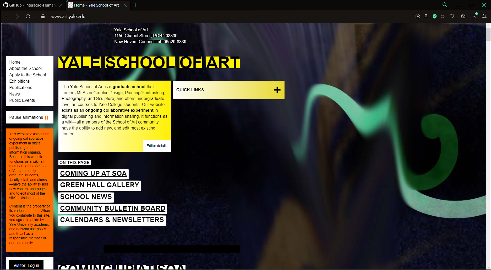
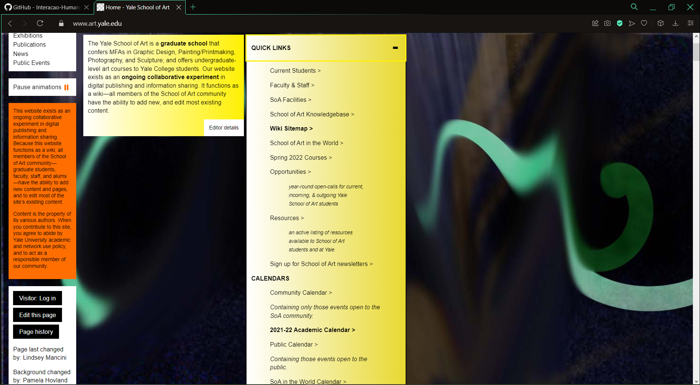
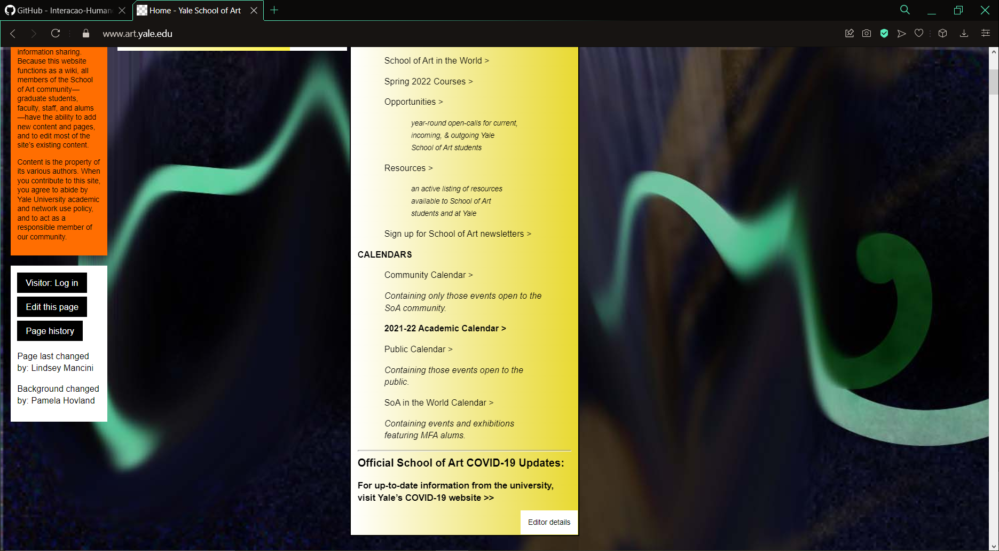
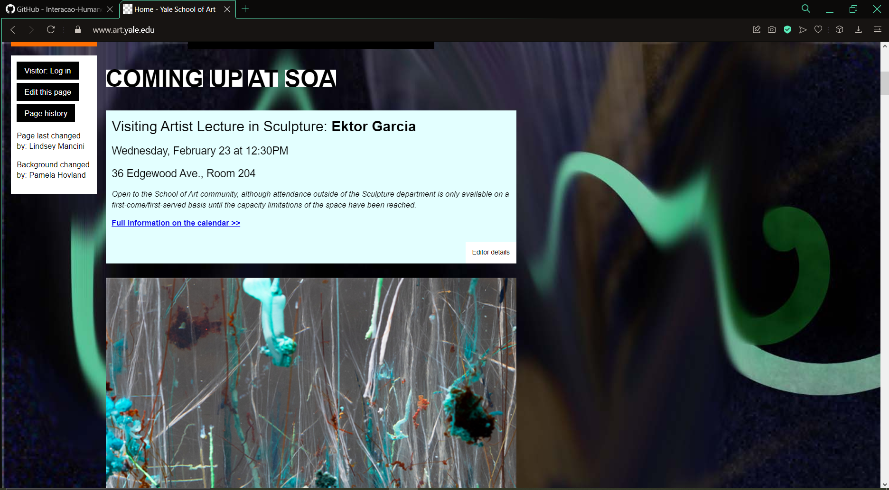
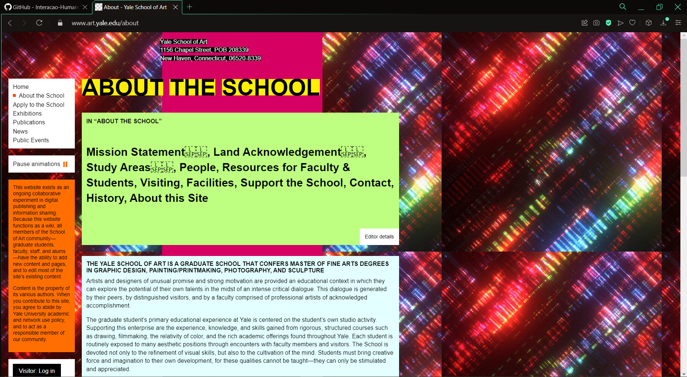
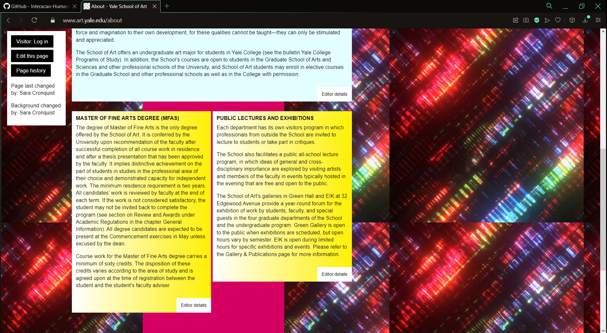
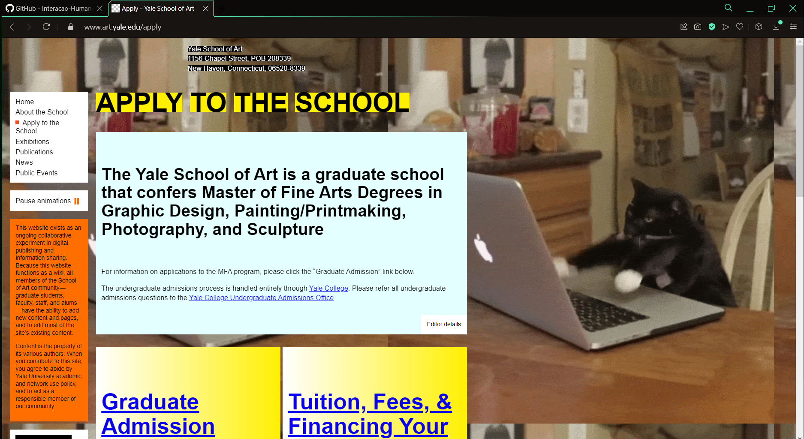
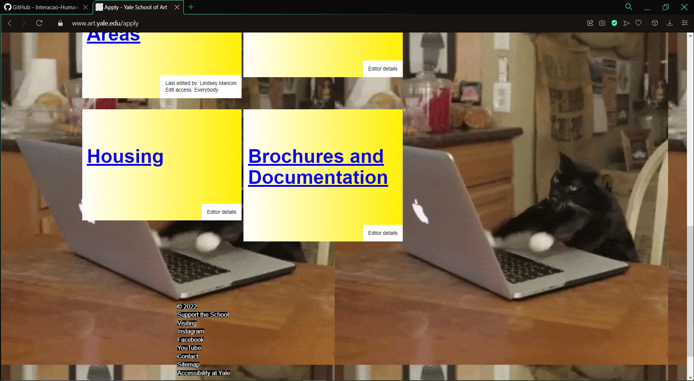

# Projeto Yale School of Art

Escolhemos o site https://www.art.yale.edu para o nosso projeto, por conta do seu estilo bagunçado e "ultrapassado", no qual abre muito espaço para melhorias, de estilo e navegação, também porquê ele nunca foi escolhido por nenhum outro grupo da matéria, portanto estava disponível.

Prints da página(tirados no dia 22/02/2022):

